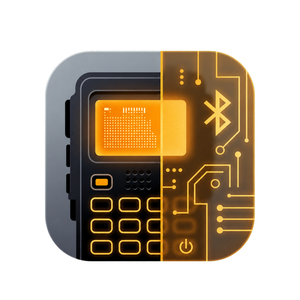

# Radtel RT-950 Pro Programmer

  

  

Android application for programming the Radtel RT-950 Pro overBluetooth Low Energy.

The app reads the radio memory into an editor, lets you make changes on the
phone, and writes the updated configuration back to the radio. It is intended
for normal field work where carrying a PC and programming cable is inconvenient.

This public repository is for signed APK downloads, release notes and user
documentation.

## Supported device
- Radtel RT-950 Pro

## Features

### Radio transfer

- Scan for nearby RT-950 Pro radios and connect over BLE.
- Read the full radio memory.
- Write the active editor state back to the radio.
- Confirm write operations before overwriting radio memory.
- Keep local profiles as backups or reusable configurations.
- Import RT-950 binary memory files.
- Export the channel list to CSV.

### Channel editor

- Edit memory channels.
- Configure RX/TX frequency, CTCSS/DCS tones and channel name.
- Set bandwidth, TX power and FM/AM receive mode.
- Toggle scan, busy lock and TX enable flags.
- Edit scrambler, encryption and FHSS fields.
- Set signal group, PTT ID and zone assignment.
- Validate frequency input before saving.

### VFO and radio settings

- Edit VFO A/B/C settings, including frequency, offset, tones, step, power,
  bandwidth and receive mode.
- Configure squelch, beep, voice prompt, display behavior, work modes,
  dual-watch, scan behavior, TOT, alarms and FM broadcast radio options.
- Edit programmable key assignments.
- Edit zone names.

### DTMF, APRS and modulation

- Edit DTMF ID, PTT-ID behavior and DTMF code groups.
- Configure APRS callsign, SSID, symbol, GPS flags, units, beacon behavior,
  routing, forwarding and custom message fields.
- Inject the phone GPS position into APRS settings when you choose to do so.
- Edit FM/AM/SSB receiver and modulation tables where that data exists in the
  radio image.

### TNC and map

- Decode APRS packets from the TNC stream.
- Show received stations on a map.
- Show packet history and station details such as speed, course, altitude and
  comment.
- Cache viewed map tiles for off-grid operations.

### Interface

- English and Polish translations.
- Dark interface

## Installation

1. Open the latest GitHub Release.
2. Download the signed APK attached to the release.
3. Install it on an Android device.
4. Android may ask you to allow installation from your browser or file manager.
5. Start the app and grant the requested Bluetooth permissions.

Use the APK attached to this repository's Releases page. ( Do not install random
copies from mirrors or chat attachments!)

## Basic workflow

1. Enable Bluetooth on the radio.
2. Scan from the app and connect to the RT-950 Pro.
3. Run `Read from Radio`.
4. Save a profile before making larger changes.
5. Edit the settings you need.
6. Run `Write to Radio`.
7. Keep the phone close to the radio until the operation finishes.
8. Read the radio again if you want to verify the written state.

Writing memory replaces the radio configuration with the active editor state.
**Always keep a backup profile before changing a radio you rely on.** Bluetooth programming is convenient but can occasionally experience drops or bugs — having a backup ensures you won't lose your configuration.

## Permissions and privacy

The app does not use accounts and does not upload radio profiles to a backend
service.

- Bluetooth / Nearby Devices: used to scan for and connect to the radio.
- Location: required by Android for BLE scanning on some versions, and used
  locally when you inject phone GPS coordinates into APRS settings.
- Internet / Network State: used by the map view to download map tiles.
- Vibration: used for local haptic feedback.

## Known limitations

- Bluetooth programming on this radio is a complex process and might still have bugs. Release builds should be tested carefully on a real RT-950 Pro before field use, especially around full memory writes.
- Firmware versions may differ. If a setting behaves differently on your radio, report it with the firmware version if you know it.
- Map display depends on map tile availability and network access for areas that have not been cached yet.

## Bug reports

Bug reports are welcome.

When opening an issue, please include:

- app version
- Android version and phone model
- radio model and firmware version if known
- what you were doing: scan, read, edit, write, profile import/export or TNC/APRS
- exact steps to reproduce the problem
- screenshot or short screen recording if it helps
- whether the issue happens every time or only sometimes

## License

Copyright (c) 2026 SP3ARK. All rights reserved.

The APK is distributed as proprietary closed-source software. You may download
and use the provided release build according to the license included with this
repository.

Use the software at your own risk. You are responsible for programming legal
frequencies and operating the radio according to the rules that apply in your
country.
