# Radtel RT-950 Pro Programmer

  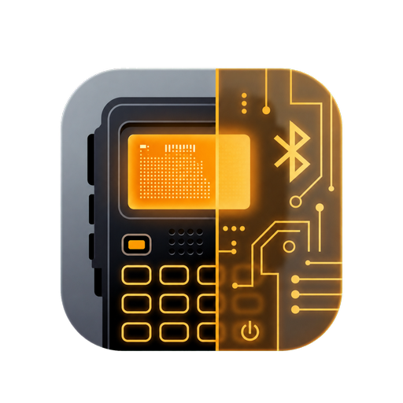

  
  

Android application for programming the Radtel RT-950 Pro over Bluetooth Low Energy.

The app reads the radio memory into an editor, lets you make changes on the
phone, and writes the updated configuration back to the radio. It is intended
for normal field work where carrying a PC and programming cable is inconvenient.
It also decodes the APRS traffic the radio hears, shows it on a map, and can
pass it on to APRS-IS as a receive-only iGate.

This public repository is for signed APK downloads, release notes and user
documentation.

## Screenshots

<table>
  <tr>
    <td align="center">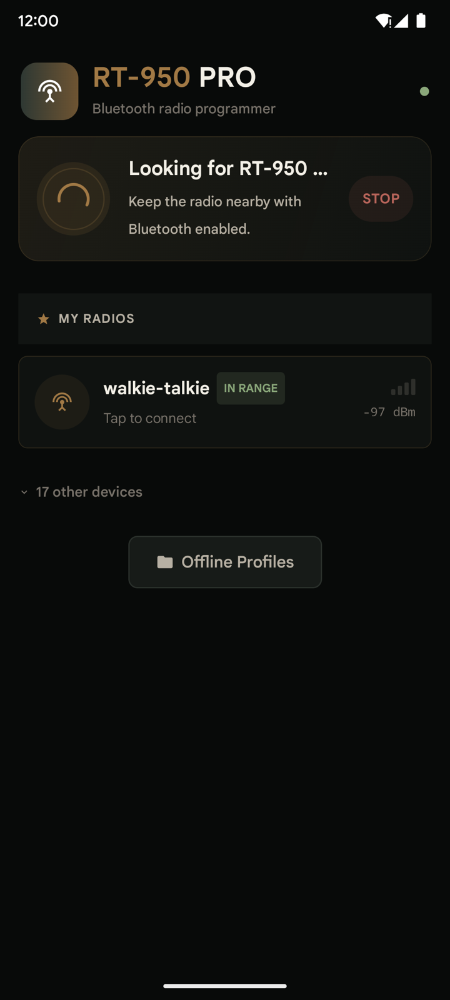 Connect</td>
    <td align="center">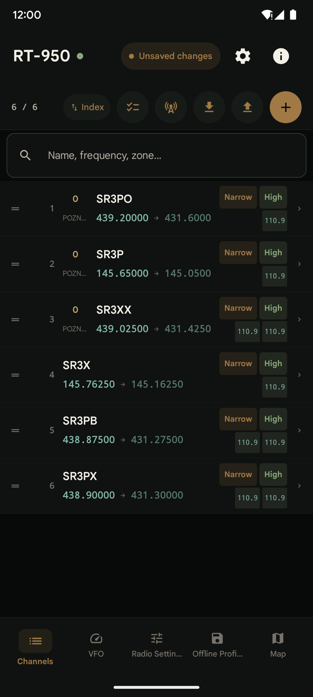 Channels</td>
    <td align="center">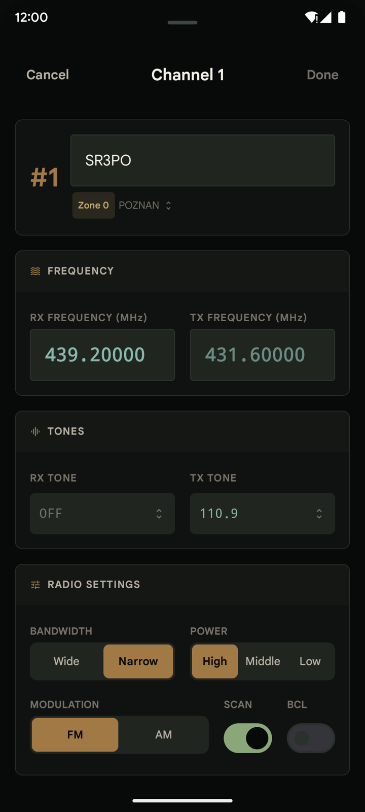 Channel editor</td>
    <td align="center">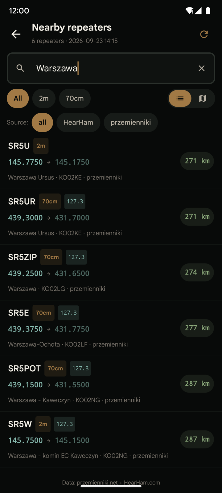 Repeater browser</td>
    <td align="center">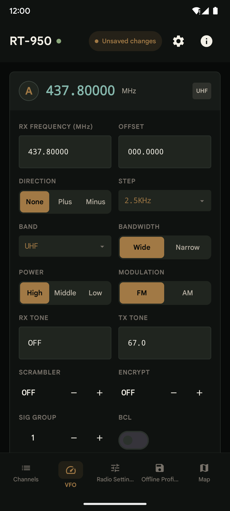 VFO</td>
  </tr>
  <tr>
    <td align="center">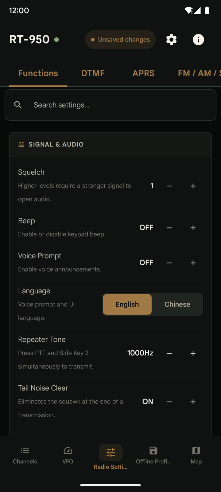 Radio settings</td>
    <td align="center">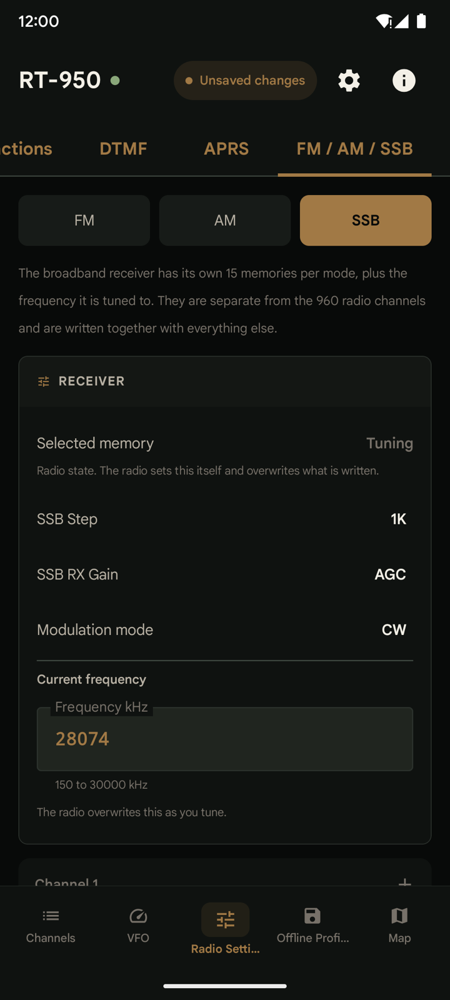 FM / AM / SSB receiver</td>
    <td align="center">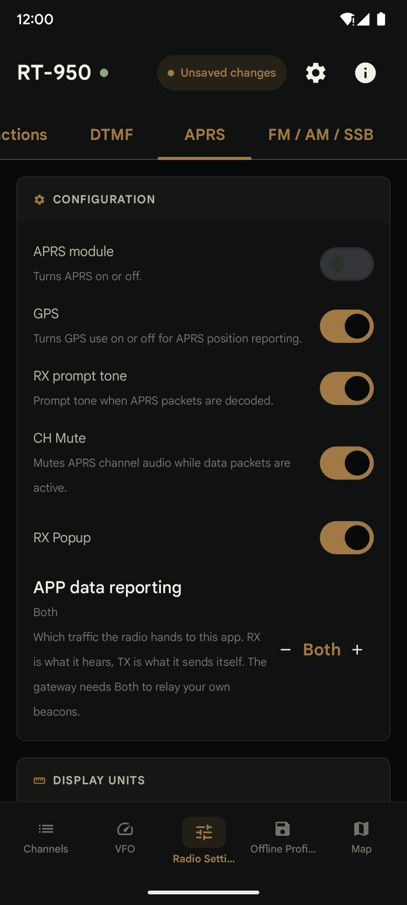 APRS</td>
    <td align="center">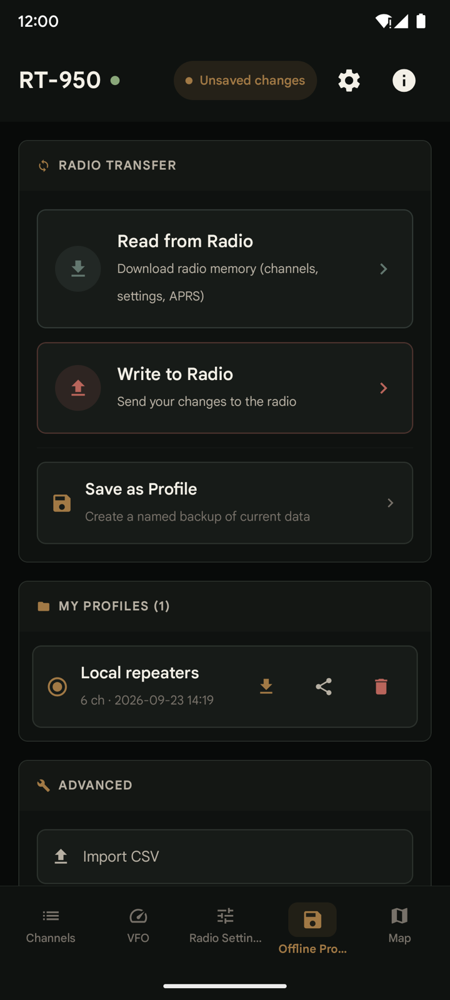 Transfer and profiles</td>
    <td align="center">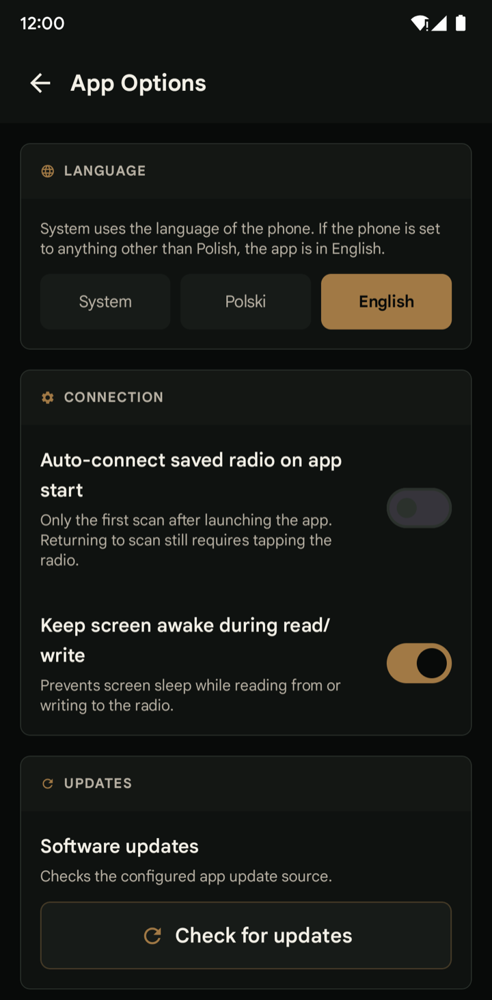 Language and options</td>
  </tr>
</table>

## Requirements

- Radtel RT-950 Pro
- Android 9 or newer, with Bluetooth LE

## Features

### Reading and writing

- Scan for nearby radios, or reconnect to one you have used before. Saved radios
  can be connected automatically on the first scan after launch.
- Read the full radio memory: channels, VFOs, functions, zones, DTMF, APRS and
  the FM / AM / SSB receiver memories.
- Before anything is sent, the write dialog lists exactly what will change:
  channels added, removed or edited, plus VFO, functions, zones, DTMF, receiver
  memories and APRS, each with the old and new value. If nothing changed, it
  says so.
- Writes are differential: only the parts of memory that changed are sent, so a
  small edit finishes in a few seconds. If a channel was deleted, or the current
  data did not come from the radio, the app writes everything.

### Channel editor

- Memory channels with search, sorting by index, name, frequency or zone,
  and drag-to-reorder.
- RX/TX frequency, channel name, CTCSS/DCS tones, bandwidth, TX power and the
  FM/AM receive mode.
- Scan, busy lock, encryption, scrambler, FHSS and its code, signal
  group and PTT ID.
- Select several channels and change power, bandwidth, modulation, scan or busy
  lock for all of them at once, or delete them together.
- Zone assignment picks a free slot in the target zone and tells you up front
  which one it will be. Full zones are marked.
- Frequencies are checked as you type against the 18-620 MHz range.
- Deleting a channel asks first and leaves an undo button.
- Search matches more than names: tones, mode, bandwidth and power all work, so
  "88.5", "AM" or "narrow" find what you would expect.

### Repeater browser

- FM repeaters shown as a list or on a map.
- Limited to working analog FM machines on 2 m and 70 cm, the bands the
  RT-950 Pro can transmit on, de-duplicated across both sources and sorted by
  distance from the phone.
- Search by callsign or place, filter by band or source.
- One tap puts a repeater into a channel with its RX/TX frequencies, CTCSS tone
  and callsign. The dialog suggests the first free channel and warns before
  overwriting an occupied one.
- The list is downloaded on first use, then kept on the phone and used offline.
  It only updates when you press refresh.

### VFO, radio settings and zones

- VFO A, B and C: frequency, offset and direction, step, band, tones, bandwidth,
  power, receive mode, busy lock, encryption, scrambler, FHSS and signal group.
- Around 50 radio settings grouped into signal and audio, work mode, display,
  VOX, scanning, timing, DTMF/PTT, side keys and cross-band transfer. A search
  box finds them by name: type "TOT", "VOX" or "backlight" instead of
  scrolling.
- Programmable key assignments, including the long-press functions of the
  number keys.
- Names for all zones.

### FM / AM / SSB receiver

- The broadband receiver keeps its own memories, separate from the main
  channels: 15 for FM, 15 for AM and 15 for SSB, each with a name and a
  frequency. SSB memories also carry the beat offset.
- Per mode: tuning step, RX gain and, for SSB, LSB, USB or CW.
- Frequencies are entered the way the radio shows them: MHz for FM, kHz for AM
  and SSB.

### DTMF and APRS setup

- DTMF ID, PTT-ID behaviour.
- APRS callsign and SSID, map symbol (with a searchable icon picker and
  favourites), working channel, display units, timezone, path and routing.
- Beacon type, interval, message, TX delay, Mic-E and compressed format.
- Fixed position set by tapping the map, or copied in from the phone GPS when
  you ask for it.
- Digipeat forwarding: channel, routing and the wait before a packet is passed
  on, plus a custom message field.
- Which APRS traffic the radio passes to the app: what it hears, what it sends,
  or both.

### APRS reception and map

- Decode APRS packets from the radio's TNC over Bluetooth, in KISS or raw text
  mode. Position reports, Mic-E, objects, items, third-party traffic and
  course/speed data are all handled.
- Received stations appear on a map with their APRS symbols and a heading arrow,
  on dark or light tiles, with a button to centre on your own position. Stations
  from APRS-IS can be shown on the same map.
- A packet log and per-station details: when it was last heard, speed, course,
  altitude and comment. Tap a frequency to see which stations use it.
- AR mode points the camera at a station and overlays bearing and distance,
  using the phone compass and GPS. It says so when the fix or the APRS data is
  too old to trust the direction.

### APRS-IS gateway

- Connect to APRS-IS to see other stations on the map. Connecting on its own
  sends nothing.
- Turn on relaying and the phone becomes a receive-only iGate: packets the radio
  hears go to APRS-IS under your callsign and passcode, byte for byte, with the
  digipeater path. Packets marked NOGATE or RFONLY are not relayed.
- Keeps running with the app closed and the screen off. A notification shows the
  state and has a stop button.
- Optional gateway beacon every 30 minutes, under its own SSID,
  with a comment and a position you set on a map. Off by default.

### Files and profiles

- Save any state as a named profile on the phone, load it back, or share it as
  a `.bin` file to move it to another phone.
- Compare two saved profiles and see every field that differs.
- Open `.bin` images: the app's own format, CHIRP images and older 45056-byte
  dumps.
- Export channels to CSV, and import both the app's own CSV and CHIRP CSV.

### The app itself

- English and Polish. By default the app follows the phone language; App
  Options lets you pick one.
- Dark interface.
- A short tutorial on first launch, replayable from App Options, and a
  "What's New" page after each update.
- If the app crashes, the next start offers to send a report. You choose where
  it goes. Nothing is sent on its own.
- A notice when a new app release is out, and when new radio firmware is
  published.

## Installation

1. Open the latest GitHub Release.
2. Download the signed APK attached to the release.
3. Install it on an Android device.
4. Android may ask you to allow installation from your browser or file manager.
5. Start the app and grant the requested Bluetooth permissions.

To update, install the new APK over the old one. Profiles, saved radios and
gateway settings stay.

Use the APK attached to this repository's Releases page. Do not install random
copies from mirrors.

## Basic workflow

1. Enable Bluetooth on the radio.
2. Scan from the app and connect to the RT-950 Pro.
3. Run `Read from Radio`.
4. Save a profile before making larger changes.
5. Edit the settings you need.
6. Run `Write to Radio`, check the list of changes and confirm.
7. Keep the phone close to the radio until the operation finishes.
8. Read the radio again if you want to verify the written state.
9. If you use the TNC map or the gateway, restart the radio afterwards (see
   Known limitations).

Writing memory replaces the radio configuration with the active editor state.
**Always keep a backup profile before changing a radio you rely on.** Bluetooth
programming is convenient but can occasionally drop or hit a bug, and a backup
means you will not lose your configuration.

## Permissions and privacy

The app does not use accounts and does not upload radio profiles anywhere.

- Bluetooth / Nearby devices: find and connect to the radio.
- Location: your position on the map, distances in the repeater browser, the
  gateway beacon position, and copying the phone GPS into APRS settings - it is also required for Bluetooth scanning.
- Camera: only for AR mode. The app works without it.
- Internet: map tiles from openstreetmap.org, repeater lists, APRS-IS when you connect to it, and the update check.
- Notifications: the gateway runs in the background with a notification.
- Vibration: haptic feedback.

What leaves the phone:

- At start the app asks site.radiogrid.online whether a newer version exists.
  The request carries only the app version.
- With relaying on, packets your radio hears are sent to APRS-IS.
- With the gateway beacon on, the position you set is published on APRS-IS,
  where it is public and kept in history by sites such as aprs.fi.
- A crash report leaves the phone only if you send it.

The app never makes the radio transmit. It only reads and writes its memory and
receives the frames the radio hands over.

## Known limitations

- Radio firmware bug: after any read or write over Bluetooth the radio stops
  sending APRS frames to the app until it is power cycled. Nothing the app can
  send brings it back, so restart the radio after programming it if you use the
  TNC map or the gateway. The app shows a warning when this happens.
- Bluetooth programming on this radio is a complex process and might still have
  bugs. Test carefully on your own RT-950 Pro before relying on it in the field,
  especially full memory writes.
- Firmware versions may differ. If a setting behaves differently on your radio,
  report it with the firmware version if you know it.
- RepeaterBook is not included yet. It needs a per-user API token and the app's
  registration is still pending. The other repeater sources work with no setup.

## Bug reports

Bug reports are welcome.

When opening an issue, please include:

- app version
- Android version and phone model
- radio model and firmware version if known
- what you were doing: scan, read, edit, write, profile import/export, TNC/APRS
  or the gateway
- exact steps to reproduce the problem
- screenshot or short screen recording if it helps
- the crash report, if the app offered one after a crash
- whether the issue happens every time or only sometimes

## License

Copyright (c) 2026 SP3ARK. All rights reserved.

The APK is distributed as proprietary closed-source software. You may download
and use the provided release build according to the license included with this
repository.

Use the software at your own risk. You are responsible for programming legal
frequencies and operating the radio according to the rules that apply in your
country.
